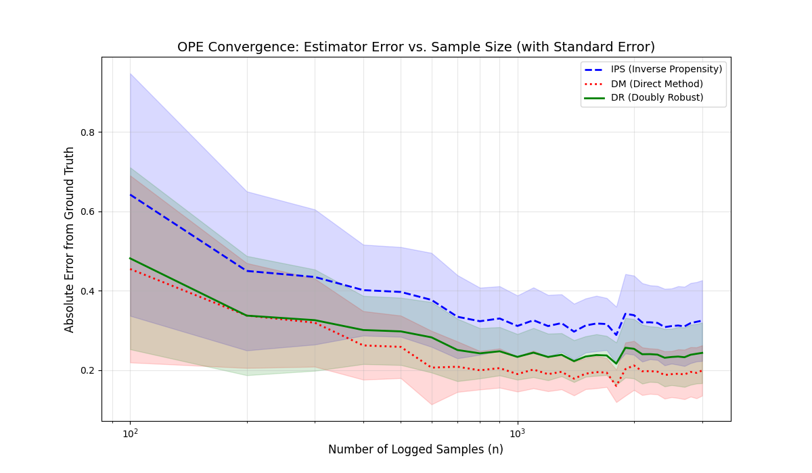
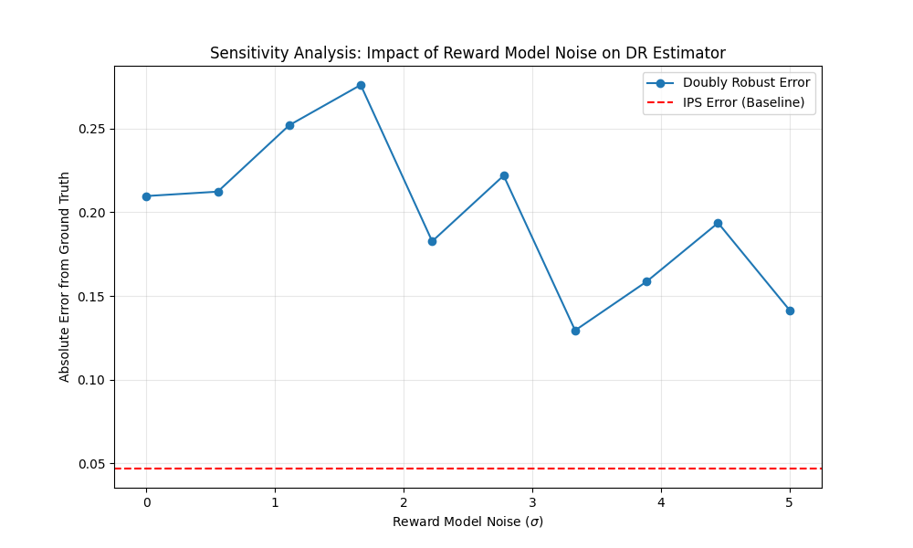

# Robust Off-Policy Evaluation for Decision-Making in Recommendation Systems

> ## **Overview**
Offline evaluation is a central challenge in recommender systems and decision-making under uncertainty. When interaction data is generated by historical (logging) policies, estimating the performance of new recommendation policies requires counterfactual reasoning. Off-Policy Evaluation (OPE) methods address this challenge but are known to suffer from instability, bias, and sensitivity to model assumptions.
This repository provides a research-oriented empirical study of classical and modern OPE estimators, with a particular focus on bias–variance trade-offs, policy divergence, and model misspecification in contextual bandit recommendation settings.

---

## **Research Question**
How reliable are standard off-policy evaluation estimators for recommender systems under policy mismatch and reward model misspecification, and where do their breakdown points occur?

---

## **Contributions**
Empirical comparison of IPS, Direct Method (DM), and Doubly Robust (DR) estimators
Controlled analysis of estimator behavior under policy divergence
Sensitivity study of reward model misspecification
Identification of regimes where hybrid estimators fail despite theoretical guarantees
Fully reproducible benchmarking framework for offline decision evaluation

---

##  Background & Theoretical Framework

This project builds upon the foundational principles of Counterfactual Risk Minimization (CRM) and Offline Policy Evaluation. Our implementation and experimental design are informed by the following key research pillars:

* **The Doubly Robust (DR) Estimator:** As proposed by Dudík et al. (2011), we utilize the DR estimator to bridge the gap between the high-variance Inverse Propensity Score (IPS) and the high-bias Direct Method (DM).
* **The Common Support Assumption:** Our robustness study specifically tests the Positivity Assumption, which states that for any action  where , the logging policy must also have .
* **Benchmarking Standards:** Our experimental setup follows evaluation protocols established by the Open Bandit Pipeline (Saito et al., 2020), focusing on the Mean Absolute Error (MAE) relative to the ground-truth reward of the target policy.

A central focus of this study is the Common Support (Positivity) Assumption, which requires sufficient overlap between logging and target policies. We explicitly test estimator robustness as this assumption is gradually violated.

---

## **Experimental Design**
**Environment**
Contextual bandit recommendation setting
Synthetic and semi-synthetic reward generation
Ground-truth policy value available for evaluation

**Controlled Factors**
**Policy divergence**: manipulated via temperature scaling
**Sample size**: to analyze convergence and variance
**Reward model noise**: to induce misspecification

---

## **Evaluation Metrics**
To evaluate both statistical accuracy and decision reliability, we report:
Mean Absolute Error (MAE)
Estimation bias
Variance across runs
Confidence interval width and coverage


---

##  Experimental Analysis & Research Findings

### 1. Convergence Stability and Variance Reduction

Analysis of the OPE Convergence plot demonstrates the empirical validation of the Doubly Robust (DR)estimator's superiority in finite sample regimes.

* **Bias-Variance Trade-off:** While the Direct Method (DM) shows lower variance, it suffers from asymptotic bias due to reward model misspecification.
* **DR Performance:** The DR estimator successfully "interpolates" between DM and IPS, achieving a lower Absolute Error than IPS while maintaining tighter confidence bounds (Standard Error shading) as  increases.

### 2. Robustness to Policy Divergence (Temperature Scaling)

We analyzed the impact of target policy "peakiness" (controlled via temperature ) on estimation error. As  decreases, the target policy  concentrates on actions rarely explored by the logging policy .

| Temperature () | IPS MAE | IPS Std. Dev | Research Insight |
| --- | --- | --- | --- |
| **2.0 (High Support)** | 0.046 | 0.027 | High overlap leads to stable, low-error estimates. |
| **0.5 (Mid Divergence)** | 0.111 | 0.067 | Error more than doubles as policy support vanishes. |
| **0.2 (Low Support)** | 0.113 | 0.081 | Extreme variance makes IPS unreliable for greedy policies. |

**Scientific Conclusion:** This confirms that the violation of Common Support leads to quadratic growth in variance, rendering standard IPS insufficient for evaluating exploitative policies.

### 3. Sensitivity Analysis: The Impact of Model Noise

Our sensitivity analysis reveals a critical research finding regarding the DR estimator's dependence on the reward model .

* **Observation:** In high-noise regimes (), the **IPS Baseline** outperformed the Doubly Robust estimate.
* **Insight:** This suggests a "Curse of Misspecification." When reward model error exceeds the natural variance of importance weights, DR "inherits" this noise, causing it to underperform. This highlights the risk of using hybrid estimators in environments where the reward signal is difficult to model.

---

##  Reproducibility

This repository is designed as a research artifact, not a demo.
-Fixed random seeds
-Modular experiment scripts
-CI-validated execution
-Deterministic experiment pipelines

---

## **Project Structure**
 ```bash
 src/          # Estimators and environments
experiments/  # Research scripts
results/      # Figures and logs
```
---


##  Limitations & Future Work

* **Static Support:** This study assumes a static action space. Future work should investigate Infinite Action Spaces where propensity scores vanish.
* **Off-Policy Selection:** We aim to extend this work to Off-Policy Selection (OPS), determining not just the value of a policy, but the rank-order of multiple candidate policies under uncertainty.

---

##  How to Run

1. **Clone the repository:**
```bash
git clone https://github.com/laxmanmaheshwaram/Ope-RecSys-phd.git
cd Ope-RecSys

```


2. **Install dependencies:**
```bash
pip install -r requirements.txt

```


3. **Execute the experiment:**
```bash
python main.py

```

---

##  References

* Dudík, M., Langford, J., & Li, L. (2011). *Doubly Robust Policy Evaluation and Learning*.
* Swaminathan, A., & Joachims, T. (2015). *Batch Learning from Logged Contextual Bandit Feedback*.

##  Citation

```bibtex
@misc{laxmanmaheshwaram2026ope,
  author = {Laxman Maheshwaram},
  title = {Off-Policy Evaluation of Recommendation Policies Using Inverse Propensity Scoring},
  year = {2026},
  publisher = {GitHub},
  journal = {GitHub Repository},
  howpublished = {\url{https://github.com/laxmanmaheshwaram/Ope-RecSys}}
}

```
